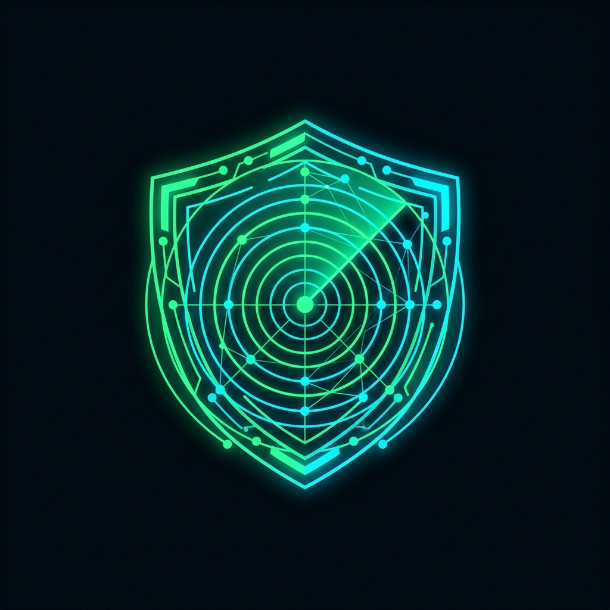
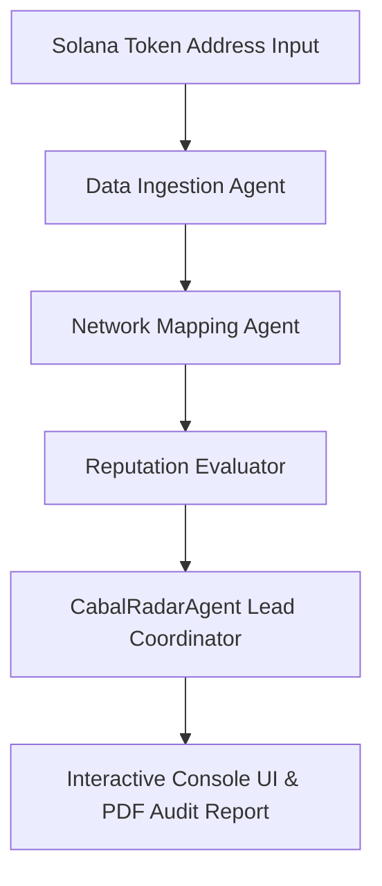

# CabalRadar ($COBWEB): Swarms Multi-Agent Solana Insider Wallet Tracker

<p align="center">
  
</p>

**CabalRadar ($COBWEB)** is a premium, state-of-the-art security intelligence dashboard built to expose hidden token creator groups, wallet coordination patterns, and Sybil clusters on the Solana blockchain. It leverages the powerful **Swarms AI Framework** alongside deep on-chain transaction graph analytics to calculate launch-block concentration metrics and assign clear risk scores to any Solana token address in real time.

---

## $COBWEB Token & Utility

**$COBWEB** is the native utility token powering the CabalRadar ecosystem. It aligns incentives between community threat hunters and developer-auditors:
*   **Premium Scan Access**: Hold/stake `$COBWEB` to unlock advanced multi-hop wallet trace depth, historical dev launch blacklists, and PDF security audit exports.
*   **Agent Priority Allocation**: Holders receive priority compute allocation on the Swarms decision agent loops when scanning active launches.
*   **Threat Bounty Pool**: Community members who flag new serial rugging addresses receive rewards from the `$COBWEB` intelligence pool.

---

## Key Features

*   **Swarms Multi-Agent Core**: Powered by a collaborative group of 4 specialized autonomous agents handling tasks from initial data fetching to graph clustering and high-level risk reasoning.
*   **Dynamic Wallet Clustering Graph**: Visual D3-like interactive physics canvas mapping genesis funding origins of early buyers to isolate sybil cartels.
*   **1-5 Block Supply Concentration Gauge**: Tracks what percentage of the token supply was swallowed by insider groups in the earliest blocks of launch.
*   **Developer Reputation Audit**: Traverses the token creator's wallet launch history across Solana DEXs to detect recurring "rug-and-dump" behaviors.
*   **Live Solana Exploit Feed**: Displays a rolling marquee of live DeFi security breaches and hacks sourced dynamically from DeFiLlama.
*   **High-Contrast Cyberpunk UI/UX**: Designed around a sleek glassmorphism HUD featuring grid backgrounds, glowing elements, and an interactive matrix scan line terminal.

---

## The Swarms Multi-Agent Architecture

Instead of relying on single linear scripts, CabalRadar utilizes **4 distinct agents** operating in a swarm coordinate model:



### 1. Data Ingestion Agent
*   **Role**: Rapidly interfaces with Solana JSON-RPC endpoints (e.g. Helius) and API providers (GoPlus Labs).
*   **Task**: Extracts early block signatures, token supply metrics, metadata properties, and developer wallet details.

### 2. Network Mapping Agent
*   **Role**: On-chain relationship analyzer.
*   **Task**: Inspects absolute genesis transaction traces of early buyers to find if multiple wallets share a common SOL funder, feeding data into the graphical UI layout.

### 3. Reputation Evaluator Agent
*   **Role**: Developer and contract behavior auditor.
*   **Task**: Validates contract authorities (mint authority renounced, freeze authority status), liquidity pool locking records, and developer history.

### 4. CabalRadarAgent (Lead Coordinator)
*   **Role**: LLM-driven Decision Engine (implemented using the `swarms` SDK package).
*   **Task**: Receives structured metrics from the helper agents, performs multi-loop threat validation, and generates detailed final reasoning logs and audit reports.

---

## Technology Stack

*   **Frontend**:
    *   **React** & **TypeScript** (built with Vite)
    *   **Vanilla CSS** (Cyberpunk/Glitch theme variables, CRT scanline overlay, circuit grid backdrops)
    *   **Lucide React** (icons)
*   **Backend**:
    *   **Python 3.10+**
    *   **FastAPI** & **Uvicorn** (asynchronous server)
    *   **Swarms SDK** (Multi-Agent framework orchestrator)
    *   **OpenAI GPT-4o** (agent decision maker)
    *   **GoPlus API** (token & address safety screening)

---

## Installation & Setup

### 1. Prerequisites
Make sure you have python (3.10+) and node (18+) installed.

### 2. Backend Setup
1. Navigate to the backend directory:
   ```bash
   cd backend
   ```
2. Create and activate a Python virtual environment:
   ```bash
   python -m venv venv
   # On Windows:
   venv\Scripts\activate
   # On macOS/Linux:
   source venv/bin/activate
   ```
3. Install dependencies:
   ```bash
   pip install -r requirements.txt
   ```
4. Create a `.env` file in the `backend` folder based on `.env.example`:
   ```env
   OPENAI_API_KEY=your_openai_api_key_here
   SOLANA_RPC_URL=your_solana_rpc_url_here  # Optional (falls back to public Solana node)
   PORT=8000
   ```
5. Run the backend server:
   ```bash
   python -m backend.app
   ```
   *The backend will boot up on `http://127.0.0.1:8000`.*

### 3. Frontend Setup
1. Navigate to the frontend directory:
   ```bash
   cd ../frontend
   ```
2. Install npm dependencies:
   ```bash
   npm install
   ```
3. Boot the Vite development server:
   ```bash
   npm run dev
   ```
   *The client will start running locally at `http://localhost:5173/`.*

---

## License

This project is licensed under the MIT License. Built with ❤️ using the [Swarms Framework](https://github.com/kyegomez/swarms).
